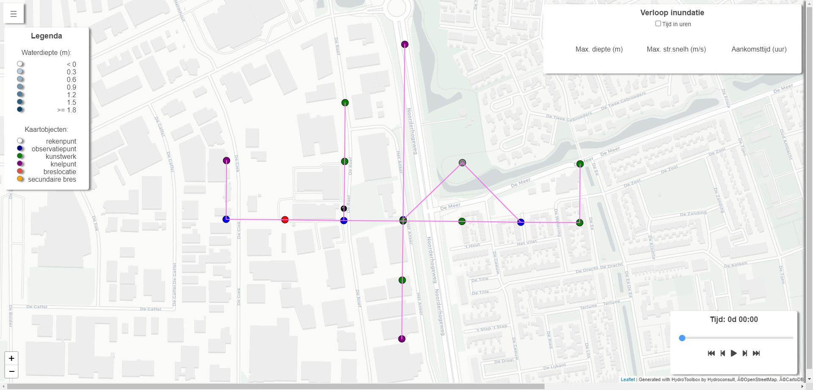

# RibasimViewer
A universal webviewer for Deltares' RIBASIM projects.
The webviewer consists solely of HTML, Javascript and CSS, thus making it extremely lightweight and portable. A webserver is NOT necessary.
Launching the application is simply a matter of double-clicking index.html.

The viewer can be populated with a RIBASIM model topology and simulation results by using the Community Edition of Hydroconsult's HydroToolbox software (first release expected in October 2023).

## Requirements
A token for Mapbox is required in order to plot the background map. This token should be implemented in config.js in the /js folder:

let MAPBOX_TOKEN = 'your_mapbox_token';

Request your own token at https://docs.mapbox.com/help/getting-started/access-tokens/.
In case the application is populated and launched from within the community edition of HydroToolbox (Hydroconsult) the required token is included.

## Populating the viewer
Populating the viewer with the topology and results of your Ribasim-project can be done with the Community Edition of [HydroToolbox](https://www.dropbox.com/s/x0fsj3k9gwh8xr4/HydroToolboxSetup-v2.6.3-x64.zip?dl=0) software, version 2.6.3.0 (Hydroconsult, The Netherlands). Currently, HydroToolbox is suitable for postprocessing results of Ribasim version 2023-10.

A set of two sample projects can be found [here](https://www.dropbox.com/scl/fi/72se3d8r4b3vngteb6l06/99.Modelschematisaties.zip?rlkey=iflfba09lq6qbtrgqbz8yvw7t&dl=0)

A brief video demonstration of how to publish Ribasim results in the webviewer can be found [here](https://www.dropbox.com/scl/fi/3g2m82hacxfy7y71suyme/Ribasim_publish_webviewer.mp4?rlkey=nhhe2cq6qicakfliqjgawmeqg&dl=0).

## Launching the viewer
Launching the viewer is simply a matter of double-clicking the index.html file. The application will open in your default internet-browser.

## Architecture
All RIBASIM-data, both the topology and the timeseries, is stored in the JS-folder in javascript-files. 
Inside each of these files a javascript-variable is defined and assigned a JSON object.
This approach makes it possible to import JSON data directly from a local directory.

For example reaches.js could look like this:

let Reaches = 
{
"type": "FeatureCollection", 
"name" :  "reachesverdict",
"crs": { "type": "name", "properties": { "name": "urn:ogc:def:crs:OGC:1.3:CRS84" } },
"features" :  [
{ "type": "Feature", "properties": { "ID": "1"},"geometry": {"type": "MultiLineString", "coordinates": [ [ [ 6.07421566552022, 53.114808874282 ],[ 6.07570905817543, 53.1148002992694 ] ] ] } },
{ "type": "Feature", "properties": { "ID": "2"},"geometry": {"type": "MultiLineString", "coordinates": [ [ [ 6.07570905817543, 53.1148002992694 ],[ 6.07720245015315, 53.1147917056428 ] ] ] } }
]
}

Here "Reaches" is a Javascript variable, to which a GeoJSON object is assigned, representing the reaches. 
By importing reaches.js in the index.html file we get access to the model's topology inside the application.

